#  Distributed Job Scheduler

A full-stack distributed job scheduling platform built using **Spring Boot**, **React**, and **PostgreSQL**.

The application allows users to create organizations, projects, queues and jobs, while providing concurrent job execution, retry handling, execution history, worker monitoring and dead letter queue support through a modern dashboard.

---

## Features

- JWT Authentication
- Multi-user workspace isolation
- Organization Management
- Project Management
- Queue Management
- Job Scheduling
- Worker Pool Simulation
- Concurrent Job Processing
- Retry Mechanism
- Dead Letter Queue
- Execution History
- Dashboard Metrics
- REST APIs
- Swagger Documentation

---

## Tech Stack

| Layer | Technology |
|--------|------------|
| Frontend | React, Material UI, Axios |
| Backend | Spring Boot 3, Spring Security |
| Authentication | JWT |
| Database | PostgreSQL |
| ORM | Spring Data JPA |
| Documentation | Swagger OpenAPI |
| Build Tool | Maven |

---

# System Architecture

The application follows a layered architecture consisting of Presentation, Application, Processing and Persistence layers.

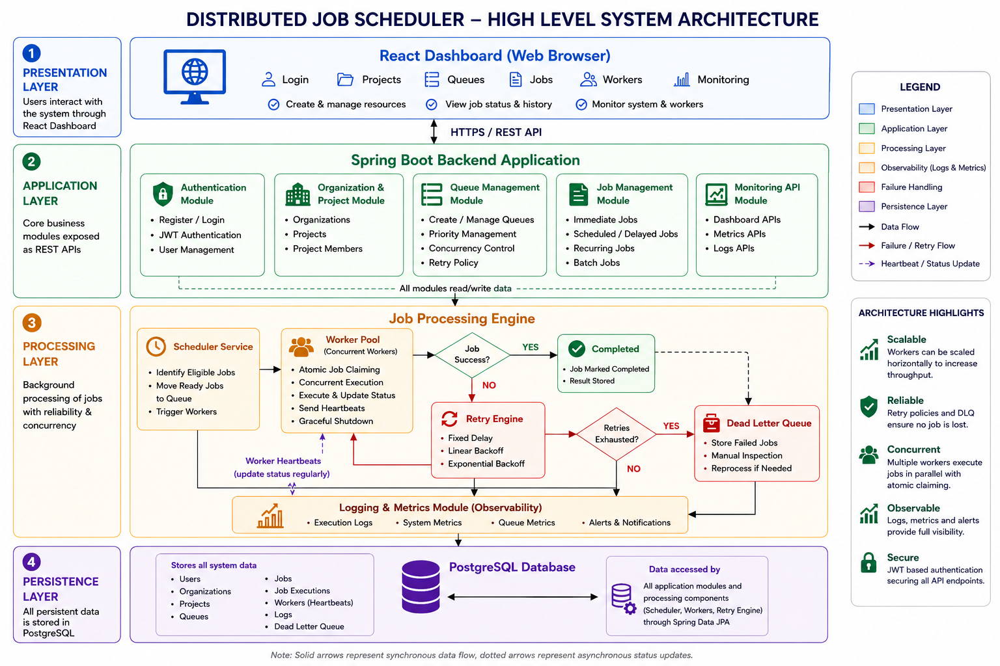

---
# Entity Relationship Diagram

The following ER diagram represents the database schema used in the Distributed Job Scheduler.


---

# Application Screenshots

## Login

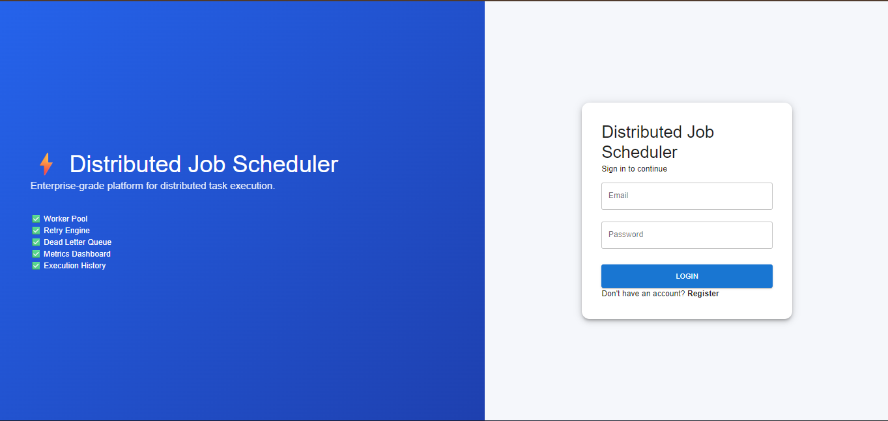

---

## Dashboard

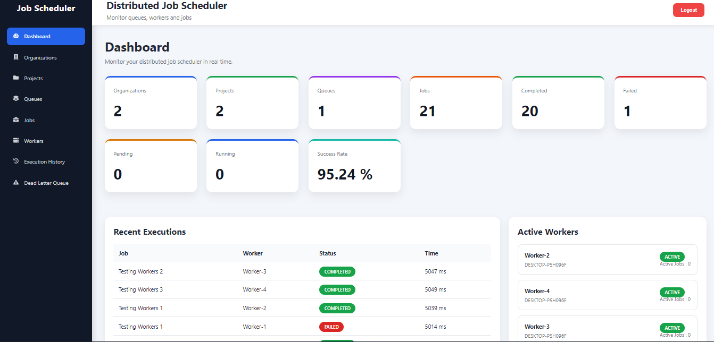

---

## Organizations

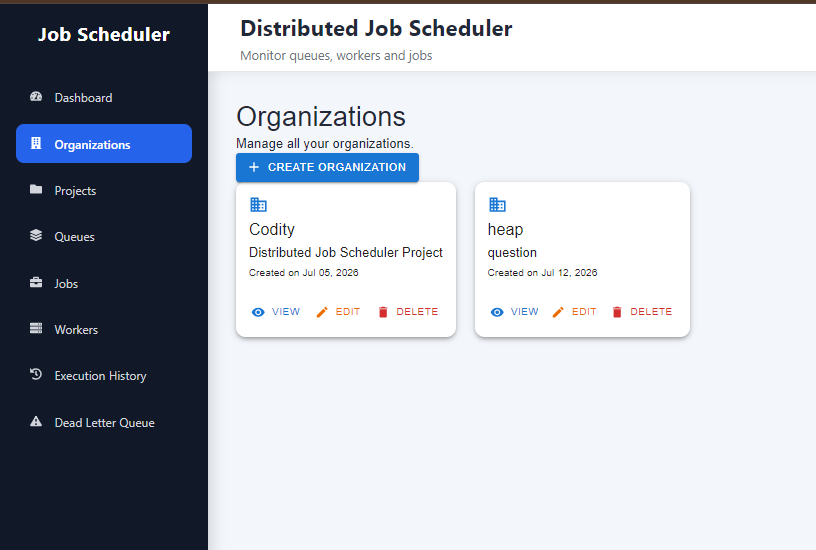

---

## Projects

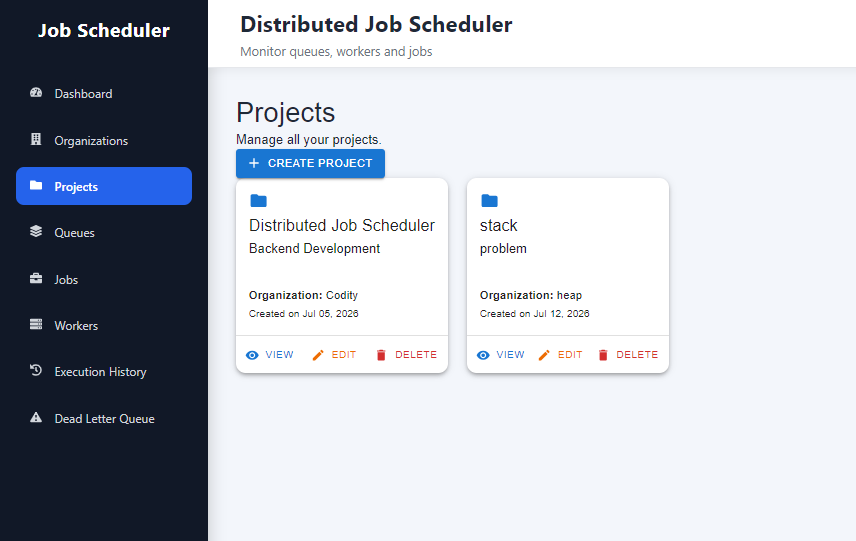

---

## Queues

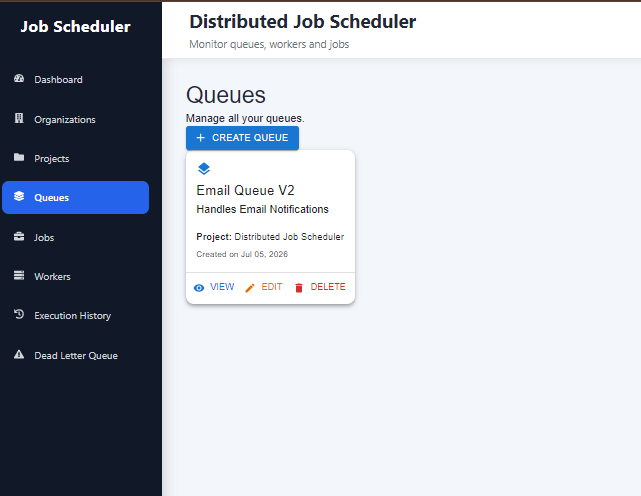

---

## Jobs

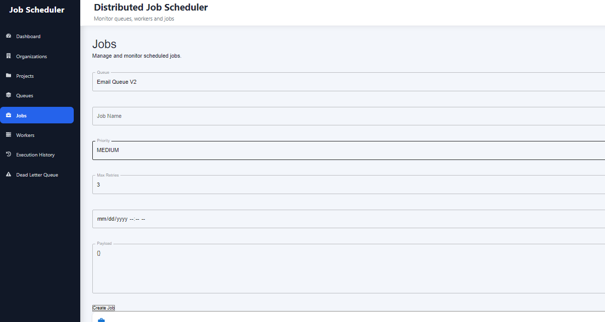

---

## Workers

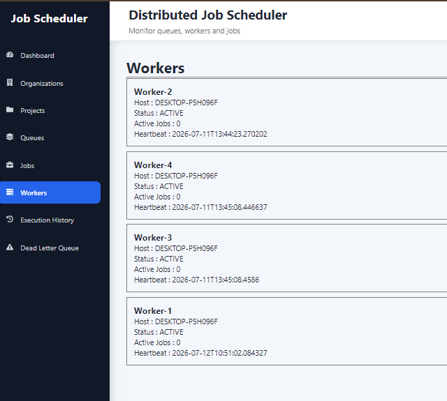

---

## Execution History

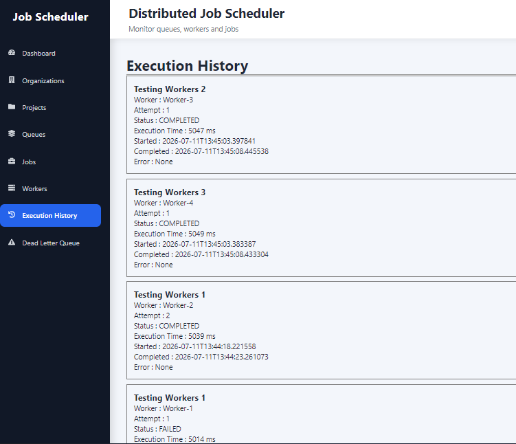

---

## Dead Letter Queue

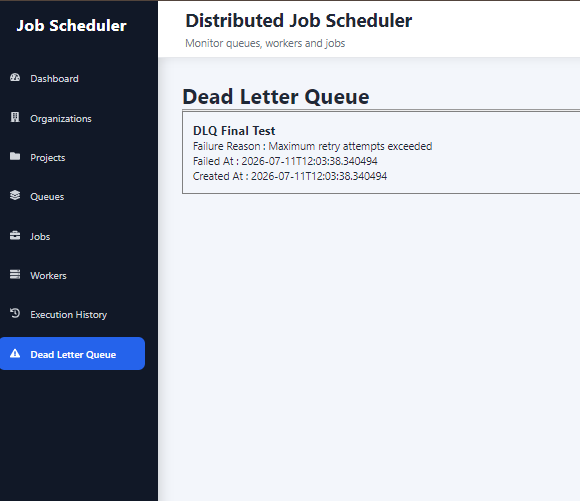

---

# Project Structure

```
distributed-job-scheduler
│
├── backend
│   ├── auth
│   ├── organization
│   ├── project
│   ├── queue
│   ├── job
│   ├── worker
│   ├── metrics
│   ├── jobexecution
│   └── deadletter
│
├── frontend
│   ├── components
│   ├── pages
│   ├── services
│   └── api
│
├── docs
│
└── README.md
```

---

# Modules

### Authentication

- Register
- Login
- JWT Authentication
- Protected APIs

### Organization

- Create
- View
- Update
- Delete

### Projects

- Create
- View
- Update
- Delete

### Queues

- Create
- View
- Update
- Delete

### Jobs

- Create Immediate Jobs
- Schedule Future Jobs
- Priority Support
- Retry Configuration

### Worker Pool

- Parallel execution
- Heartbeat updates
- Active worker monitoring

### Monitoring

- Dashboard Metrics
- Execution History
- Dead Letter Queue

---

# API Documentation

Swagger UI

```

http://localhost:9090/swagger-ui/index.html

```
Interactive API documentation is available through Swagger UI.

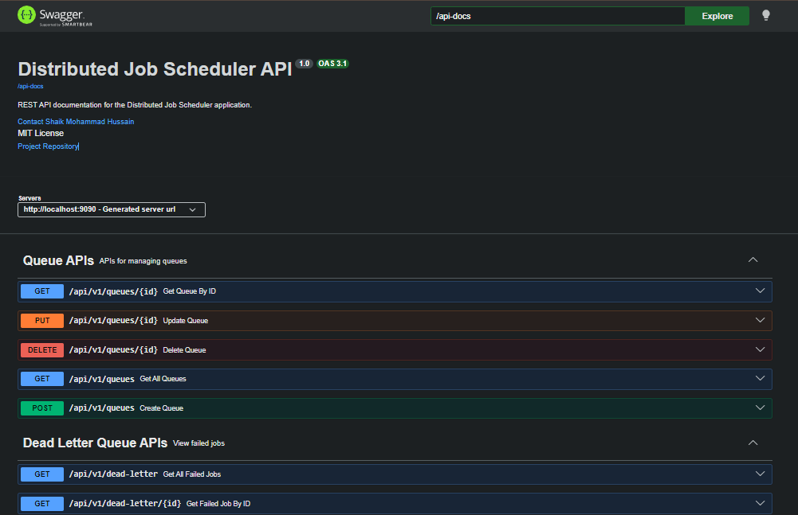

---

# Getting Started

## Clone Repository

```bash
git clone https://github.com/Hussain-mhmd/distributed-job-scheduler

cd distributed-job-scheduler
```

---

## Backend Setup

```bash
cd backend

mvn clean install

mvn spring-boot:run
```

Backend runs on

```
http://localhost:9090
```

---

## Frontend Setup

```bash
cd frontend

npm install

npm run dev
```

Frontend runs on

```
http://localhost:5173
```

---

## PostgreSQL

Create a PostgreSQL database.

Update the following properties inside

```
application.properties
```

```
spring.datasource.url=
spring.datasource.username=
spring.datasource.password=

jwt.secret=
jwt.expiration=
```

---

# Workflow

1. Register/Login
2. Create Organization
3. Create Project
4. Create Queue
5. Create Job
6. Scheduler assigns jobs
7. Workers execute jobs
8. Success updates dashboard
9. Failed jobs retry automatically
10. Maximum retry exceeded → Dead Letter Queue

---

# Current Features

| Feature | Status |
|----------|:------:|
| JWT Authentication | ✅ |
| Multi-user Isolation | ✅ |
| Organizations | ✅ |
| Projects | ✅ |
| Queues | ✅ |
| Jobs | ✅ |
| Dashboard | ✅ |
| Worker Pool | ✅ |
| Retry Engine | ✅ |
| Dead Letter Queue | ✅ |
| Execution History | ✅ |
| Metrics | ✅ |
| Swagger | ✅ |

---

# Future Improvements

- Cron Scheduling
- Email Notifications
- Role Based Access Control
- Docker Deployment
- Kubernetes Deployment
- Redis Queue Support
- RabbitMQ Integration
- Prometheus & Grafana Monitoring

---

# Author

**Shaik Mohammad Hussain**

B.Tech Computer Science Engineering

SRM Institute of Science and Technology

---